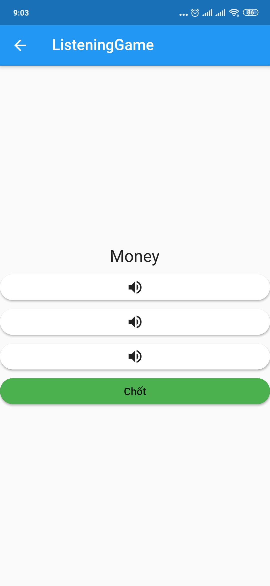
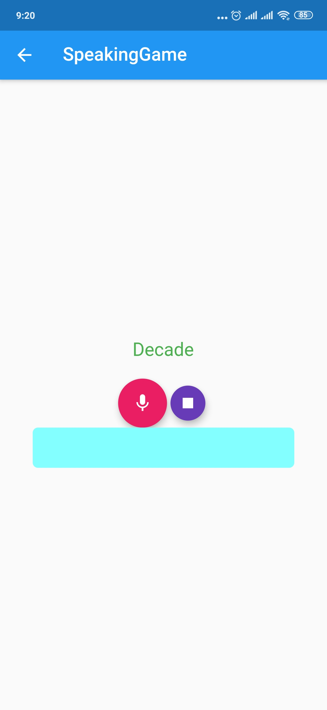

# App Từ vựng
# Framework : Flutter
## Getting Started
### Ứng dụng học từ vựng tiếng Anh cho học sinh / sinh viên trên Android.
### Phần mềm sẽ cung cấp từ vựng theo từng Unit và từng Book giúp người đọc dễ dàng học. Các từ đều có ảnh minh họa, phát âm và diễn giải giúp cho người học nhớ lâu hơn.
## API Link :  https://abc-x.azurewebsites.net
## Cơ sở dữ Liệu

## Minh Họa

